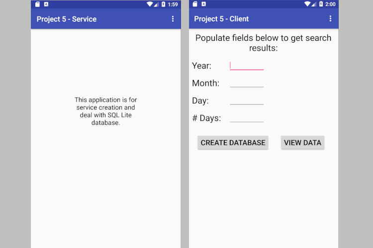
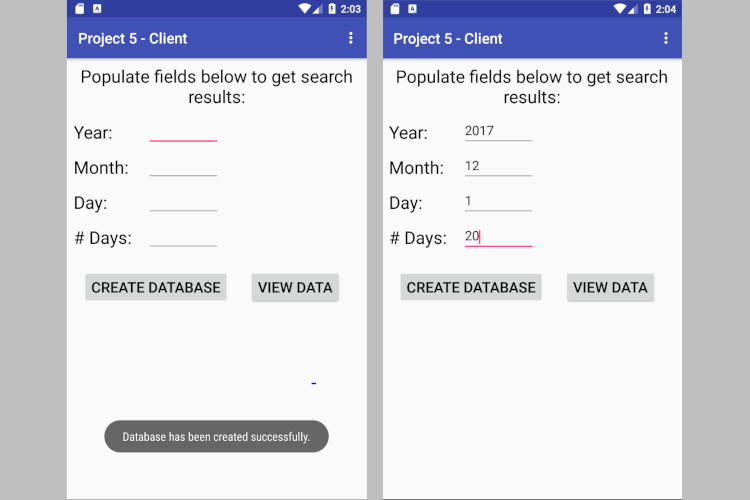
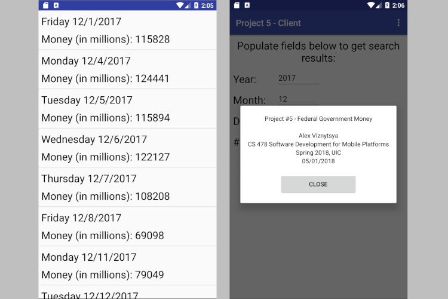

# money-on-hand
How much federal government has money on hand 2017 - 2018

This project is about two Android apps that help users find out how much money the federal goverment of the US had on hand on any given working day in the year 2017. The web site treasury.io provides this data. However, data for entire 2017 an first month of 2018 is stoted in .txt file that is transfered to SQLite database during database creation by Android service. Each line contains the following items, separated by commas, for a given day:  
1. Year (either 2017 or 2018)
2. Month (1—12)
3. Day (1—31)
4. Day of week (e.g., “Monday”)
5. Amount held by US at day open in millions of US dollars
6. Amount held by US at day close in millions of US dollars

In summary, this project creates an SQLite database that formats the data in thetext file in a single table. Service app defines a bound service called BalanceService exposing an API for creating and querying the database. The first app acts as a client. The main activity in the this app defines fields for creating and querying a database. Upon pressing a first button the activity will issue an API call for creating a database to the service. If the database is created successfully,a user can press a second button to view the amount of money held by the US in each day of a prespecified range. In addition the UI of app contains three fields for specifying a date range(e.g.,the month and day for the starting day of the date range, and the total number of working days in the range). Upon pressing the second button, main activity will check that the specified date range is valid. If successful, the activity will issue an API call for obtaining the specified data from the service. The data will be displayed in a list view contained in a second activity. The user can return to the main activity by pressing the “back” button on the device. The second app defines a bound service called BalanceService that manages the database as well as database queries. The API exposed by BalanceService consists of the following two remote methods:
1. createDatabase() : Boolean — This zero-argument method reads the text file and creates the SQLite database used for subsequent querying. It returns true or false depending on whether the database was successfully created or not.
2. dailyCash(int, int, int, int) : ArrayList<String> — This method takes as input 4 integers: a day, a month, a year, and a number of working days. The first 3 integers denote a date in years 2017 or 2018. The last integer denotes a number of working days between 1 and 30. If the database had not been created before this method is called,the method returns null.

